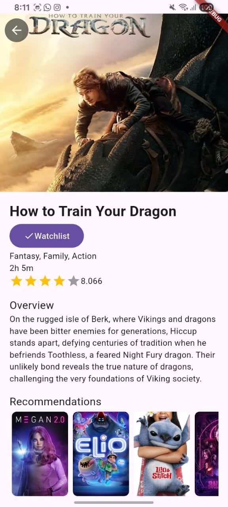
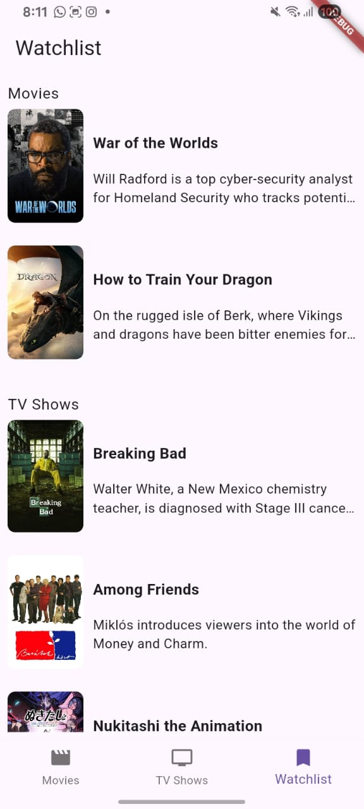
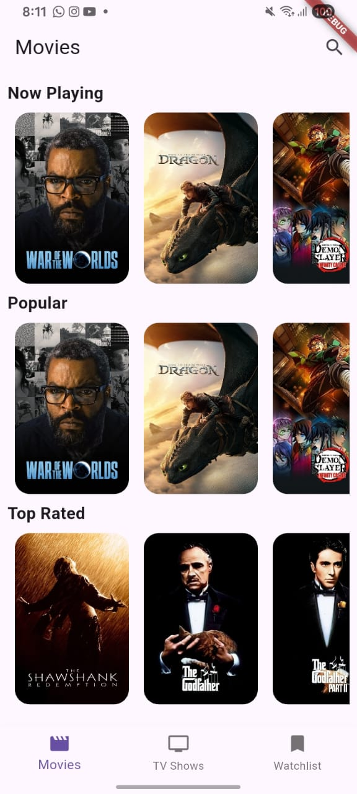

# 🎬 IMDB App - Flutter Movie & TV Show Catalog

A Flutter application that allows users to browse, search, and bookmark movies and TV shows using data from The Movie Database (TMDb) API.


---

## ✨ Features

- 🔍 **Search** movies and TV shows
- 🎞️ **Now Playing**, **Popular**, and **Top Rated** movies
- 📺 **On The Air**, **Popular**, and **Top Rated** TV shows
- ✅ **Add/Remove from Watchlist**
- 📄 **Detail view** with overview, genres, runtime, and recommendations
- 🧭 **Bottom navigation** between Movie, TV Show, and Watchlist
- ❤️ **BLoC Pattern** using `flutter_bloc`, `freezed`, and `equatable`
- 🗃️ **Local caching** with SQLite using `sqflite`

---

## 📱 Screenshots

 |  | 

---

## 🚀 Getting Started

### 🔧 Prerequisites

- Flutter SDK `>=3.0.0`
- Dart `>=2.17.0`
- API key from [TMDb](https://www.themoviedb.org/)

### 🛠️ Installation

```bash
git clone https://github.com/rapaccel/imdb_app.git
cd imdb_app
flutter pub get
```
